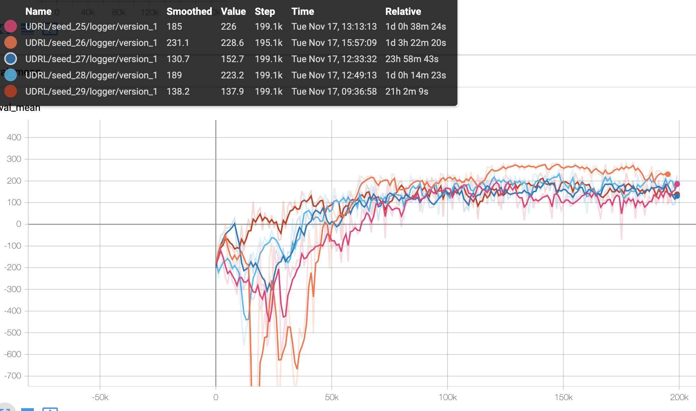
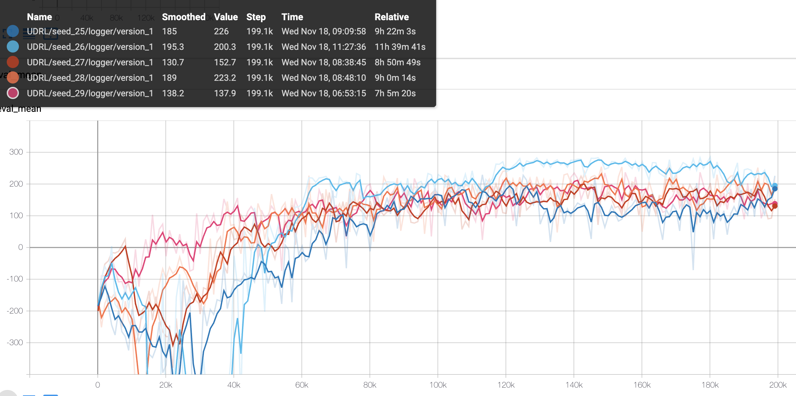

# Reward Conditioned Policies / Upside Down Reinforcement Learning

This is an open source library that seeks to replicate the results from the papers: [Reward Conditioned Policies](https://arxiv.org/pdf/1912.13465.pdf) (RCP) and [Training Agents using Upside-Down Reinforcement Learning](https://arxiv.org/abs/1912.02877) (UDRL) neither of which shared their implementations.

## State of the Codebase:


Example rollout of agent trained using UDRL for 540 epochs (54000 gradient update steps).


This code base works for LunarLander in that the agent will learn to achieve a high score. However, results appear to have a much higher variance across seeds here than in the original papers, especially for UDRL Sparse Lunar-Lander and RCP-Advantages. Even after correspondence with the authors of RCP, I have been unable to identify the bug or discrepancy in my code leading to these differences in performance outlined below: 

### Performance Comparisons:

UDRL in LunarLander environment in this codebase:



X-axis is number of gradient updates (100 per epoch). 20 rollouts per epoch. If each rollout is approx 300 environment steps then multiply this X-axis by a factor of (20*300)/100 = 60 to get environment steps.

NB. Because of different rollout lengths for each seed, some of them did not finish their training steps but I killed the job a bit early to generate all of these comparisons.

Figure from paper:


Average of 20 random seeds (5 in my case.) This is the only case where my code seems to reproduce the figure. For example, the 100K X-axis point in my code corresponds to approx. 0.6x10^7 environment steps. And the average looks to be a bit higher than 100.

UDRL in Sparse-LunarLander:


(one of the seeds died at the start of training.)

Figure from paper:


RCP-R with exponential weighting:


Figure from paper:


Average of 5 seeds. The X-axes are comparable here. Performance seems to match that of RCP-R and if anything looks somewhat more stable.

RCP-A with exponential weighting:


Figure from paper:


Average of 5 seeds. The X-axes are comparable here. Performance either seems to match that of the figure RCP-A (seeds 27 and 28) or does much worse.

I am hoping by open-sourcing this codebase, the RL community will be able to improve upon it and collectively succeed in replicating these papers. Right now, if I had to guess, the problem is either a fundamental bug I have completely missed, or more likely some small but crucial implementation detail like a form of normalization or a certain hyperparameter setting eg the Beta value used in RCP.
In [Training Agents using Upside-Down Reinforcement Learning](https://arxiv.org/abs/1912.02877) a list of hyperparameters tried is given but the best hyperparameters found never are!!! I used Ray Tune to search over all of the same hyperparameters but the results were too seed dependent to infer which hyperparameters were superior.
In [Reward Conditioned Policies](https://arxiv.org/pdf/1912.13465.pdf) none of the implementation details searched over or used are provided.

## Other Implementations:

There are a few other implementations of Upside Down Reinforcement Learning (UDRL) online already but these implementations either do not work or are very seed sensitive (see issues I have raised such as: [here](https://github.com/jscriptcoder/Upside-Down-Reinforcement-Learning/issues/1) and [here](https://github.com/BY571/Upside-Down-Reinforcement-Learning/issues/4#event-3624848392)). This code base is not only more robust and capable of running multiple seeds in parallel for UDRL but is also the first implementation of Reward Conditioned Policies with both implmentations unified in a single code base (you can also easily mix and match components of each).

## Relevant Scripts:

All experiments can be run on your local computer using CPUs for between five and fifteen hours of runtime depending on settings. Parallel processing is implemented to be able to run multple seeds at the same time but only where each seed uses one CPU. However, because of Pytorch Lightning and the Ray Tune implmementation, scaling up to more CPUs and GPUs is easy.

* `train.py` - has almost all of the relevant configuration settings for the code. Also starts either ray tune (for hyperparam optimization) or a single model (for debugging). Able to switch between different model and learning types in a modular fashion
* `bash_train.sh` - uses GNU parallel to run multiple seeds of a model
* `lighting-trainer.py` - meat of the code. Uses pytorch lightning for training
* `control/agent.py` - runs rollouts of the environment and processes their rewards
* `envs/gym_params.py` - provides environment specific parameters
* `exp_dir/` - contains all experiments separated by: environment_name/experiment_name/algorithm-implementation/seed/logged_versions
* `models/upsd_model.py` - contains the [Reward Conditioned Policies](https://arxiv.org/pdf/1912.13465.pdf) and [Training Agents using Upside-Down Reinforcement Learning](https://arxiv.org/abs/1912.02877) upside down models.
* `models/advantage_model.py` - model to learn the advantage of actions, used for RCP-A.

## Dependencies:
Tested with Python 3.7.5 (should work with Python 3.5 and higher).

Install Pytorch 1.7.0 (using CUDA or not depending on if you have a GPU)
<https://pytorch.org/get-started/locally/> 

If using Pip out of the box use: 
`pip3 install -r RewardConditionedUDRL/requirements.txt`

If using Conda then ensure pip is installed with conda and then run the same above code.  

If you want to test running with multiple seeds then install GNU Parallel: 
`sudo apt install parallel`

## Running the code:

To run a single model of the LunarLander with the UDRL implementation call:

```
python trainer.py --implementation UDRL --gamename lunarlander \                                                  
--exp_name debug \
--num_workers 1 --seed 25
```

Implementations are `UDRL` (Upside Down RL), `RCP-R` and `RCP-A` (Reward Conditioned Policies with Rewards and Advantages, respectively). For RCP the default is with exponential weighting rewards rather than advantages.
For RCP exponential weighting is turned on by before you can use the flag `--no_expo_weighting` to turn it off. The Beta weighting value is inside `trainer.py`.

Environments that are currently supported are `lunarlander` and `lunarlander-sparse`. Where the sparse version gives all of the rewards at the very end.

To run multiple seeds call `bash bash_train.sh` changing the `trainer.py` settings and experiment name as is desired.

To run Ray hyperparameter tuning, uncomment all of the `ray.tune()` functions for desired hyperparamters to search over and use the flag `--use_tune`.

Checkpointing of model is turned on by default and will save a new version of the model whenever the policy loss declines (this is defined at approx line 194 for trainer.py). To turn off model checkpointing add the flag `--no_checkpoint`. 

Multi-seed training. To test the model running multple seeds in parallel, modify the code in `bash_train.sh` which uses GNU parallel to run multiple seeds where each seed gets its own core to run on. The default is running seeds 25 to 29 inclusive. To run more seeds it is advised to use Ray Tune and line approx. 181 of `trainer.py` can be used to define the seeds to be tried. Ray Tune provides performance of each agent but currentlyl lacks as granular information during training.

In order to record episodes from epochs, used the flag `--recording_epoch_interval`. Each epoch of this interval, `record_n_rollouts_per_epoch` (in config dict, default =1) will be saved out. However, to do this either you need to run a single seed on your local computer or have xvfb installed on your server (see below for in depth instructions on how to re-install GPU drivers that incorporate xvfb). The alternative is to ensure model checkpointing is turned on and render your saved models after training using the `--eval_agent` flag and providing it with the path to the trained model.

Model checkpointing is on by default and will save the model with the best performance on achieving mean rollout reward. 

## Evaluating Training:

All training results along with important metrics are saved out to Tensorboard. To view them call: 

`tensorboard --logdir RewardConditionedUDRL/exp_dir/*ENVIRONMENT_NAME*/*EXPERIMENT_NAME*/*IMPLEMENTATION-NAME*/`

If you have run `python trainer.py` like in the above example (using seed 25 in the lunarlander environment and with debugging turned on) then the output can be seen by calling:
`tensorboard --logdir RewardConditionedUDRL/exp_dir/lunarlander/debug/UDRL/seed_25/logger/` and going to the URL generated. (Dont add the seed to the path if you are trying to view across seeds.)

To visualize the performance of a trained model, locate the model's checkpoint which will be under: `exp_dir/*ENVIRONMENT_NAME*/*EXPERIMENT_NAME*/*SEED*/epoch=*VALUE*.ckpt` and use the flag `--eval_agent exp_dir/*ENVIRONMENT_NAME*/*EXPERIMENT_NAME*/*IMPLEMENTATION-NAME*/*SEED*/epoch=*VALUE*.ckpt`.

## TODOs:
Nice to haves that either I (or you, reader!) will implement.

* Update the PyTorch Lightning loggers and track `eval_mean` instead of the policy loss. <https://github.com/PyTorchLightning/pytorch-lightning/issues/4584#issuecomment-724185789> 
* Implement the TakeCover-v0 environment. 
* Make buffers more efficient by storing whole rollout together and computing relevant statistics on the fly.
* Enable multicore training and Gym rollouts (would probably be best to use Ray RL package for this.)

## Instructions for running on a Google Cloud VM:
(in case you don't want to run on your local computer or want GPU training.)

#### Set up the VM: 
* Create a Google Cloud account
* Activate Free Credits
* Open up Compute Engine
* When it finishes setting up your compute engine go to "Quotas" and follow the instructions [here](https://stackoverflow.com/questions/45227064/how-to-request-gpu-quota-increase-in-google-cloud) to request 1 Global GPU.
* Wait for approval
* Create a new VM under Compute Engine. Choose "From Marketplace" on the left sidebar and search for "Deep Learning" choose the Google Deep Learning VM.
* Select a region (east-1d is the cheapest I have seen) and choose the T4 GPU (you can use others but will need to find the appropriate CUDA drivers that I list below yourself.)
* Select PyTorch (it has fast.ai too but we dont use this) and ensure it is CUDA 10.1
* For installation you can choose 1 CPU but at some point you will want to increase this to 16
* Select Ubuntu 16.04 as the OS
* Select you want the 3rd party driver software installed (as you will see later we install new drivers so this may be totally unnecessary but I did it and assume you have them installed in later steps)
* Add 150 GB of disk space
* Launch it.

The next two subheaders are if you want to be able to SSH into the server from your IDE (instructions provided for VS Code) (I recommend this!). But if you want to use the SSH button via Google Cloud thats fine too.

#### Connect Static IP:
In the top search bar look up "External IP" select it. Create a new static IP address. Attach it to your new VM.

(You may need to turn off and back on your VM for this to take effect.)

#### IDE SSH:
For VSCode I use the installed plugin "Remote Explorer". 
My ssh keys are in ~/.ssh so I do `cat ~/.ssh/id_rsa.pub` and copy and paste this into the SSH section of Google Cloud (Search for SSH). 

Then with my server on I get its external IP address and in VSCode remote explorer call: 
`ssh -i ~/.ssh/id_rsa SSH_KEY_USERNAME@SERVER_IP_ADDRESS`
Before following the instructions.
One thing that first caught me up is that you need to give the ssh prefix not the the specific .pub file!

#### Installing Dependencies 
With access to your server sorted, you now need to install a few dependencies:

Note - this VM comes with Conda preinstalled along with Python 2.7 and 3.5 outside of Conda. We will not be using Conda so either uninstall it or every time you log on ensure you deactivate it first! (If you can get this all working with Conda then good for you but I had problems with it early on in this project and so decided to ignore it.)

Note2 - The CUDA drivers are installed with open-gl which we do not want in order to be able to run the CarRacing Gym environment headlessly on the server. As a result we need to reinstall these drivers using the `--no-opengl-files` flag.

If you are running this on a server and your GPU expects OpenGL, then run all of the below. I run it in chunks because the CUDA installers have interactive pages.
```
conda init
exit
### reopen terminal. Conda was there but couldn't be deactivated till you do this!
conda deactivate
## deleta conda (if you want, else will need to call conda deactivate) every time
sudo rm -rf ../../opt/conda/
git clone https://github.com/TrentBrick/fem.git
sudo apt-get update

pip3 install --upgrade pip
pip3 install torch==1.5.0+cu101 torchvision==0.6.0+cu101 -f https://download.pytorch.org/whl/torch_stable.html
pip3 install -r fem/requirements.txt
sudo apt-get update -y
sudo apt-get install -y xvfb

###Setting up the GPU:::

mkdir ~/Downloads/
mkdir ~/Downloads/nvidia
cd ~/Downloads/nvidia
wget https://developer.nvidia.com/compute/cuda/10.1/Prod/local_installers/cuda_10.1.105_418.39_linux.run
wget http://us.download.nvidia.com/tesla/418.126.02/NVIDIA-Linux-x86_64-418.126.02.run
sudo chmod +x NVIDIA-Linux-x86_64-418.126.02.run
sudo chmod +x cuda_10.1.105_418.39_linux.run
./cuda_10.1.105_418.39_linux.run -extract=~/Downloads/nvidia/

### Uninstall old stuff. Choose default options. You may get some warning messages. Which is fine. 
sudo apt-get --purge remove nvidia-*
sudo nvidia-uninstall

sudo ./NVIDIA-Linux-x86_64-418.126.02.run --no-opengl-files
sudo ./cuda_10.1.105_418.39_linux.run --no-opengl-libs
### Verify installation
nvidia-smi

# install opengl.
sudo apt-get install python-opengl
```

Your server should now be fully set up to run all of the following experiments! Please don't post Issues on GPU installation as I won't be able to provide any further support and have already provided a lot more than most other ML code reproductions/support!
NB. If you are not using Conda be sure either uninstall it or to call `conda deactivate` every time you SSH in and whenever you start a new tmux terminal.

## Acknowledgements:

Thanks to the open source implementation of Upside Down Reinforcement Learning: <https://github.com/jscriptcoder/Upside-Down-Reinforcement-Learning> which provided an initial test base. Also to [Reward Conditioned Policies](https://arxiv.org/pdf/1912.13465.pdf) and [Training Agents using Upside-Down Reinforcement Learning](https://arxiv.org/abs/1912.02877) for initial research and results (I just wish both of these papers shared their code...).

## Authors:

* **Trenton Bricken** - [trentbrick](https://trentbrick.github.io/)

## License:

This project is licensed under the MIT License - see the [LICENSE.md](LICENSE.md) file for details